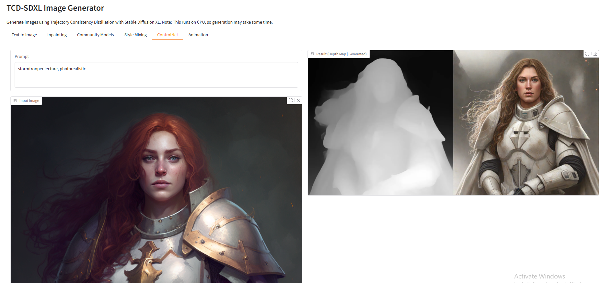

# Trajectory Consistency Distillation (TCD) with LoRA

A Gradio interface for generating images and animations using Trajectory Consistency Distillation with Stable Diffusion XL and various LoRA models.



## Features

- Text-to-Image generation with TCD scheduler
- Inpainting with TCD scheduler
- Community model support
- Style mixing with multiple LoRAs
- ControlNet depth-based generation
- Animation generation with AnimateDiff

## Installation

1. Clone this repository
2. Install the requirements:
```bash
pip install -r requirements.txt
```

## Usage

Run the Gradio interface:
```bash
python app.py
```

## Models Used

- Base Model: Stable Diffusion XL
- TCD LoRA: h1t/TCD-SDXL-LoRA
- Additional LoRAs:
  - Papercut: TheLastBen/Papercut_SDXL
  - AnimateDiff Motion: guoyww/animatediff-motion-lora-zoom-in

## License

This project is licensed under the MIT License - see the LICENSE file for details. 